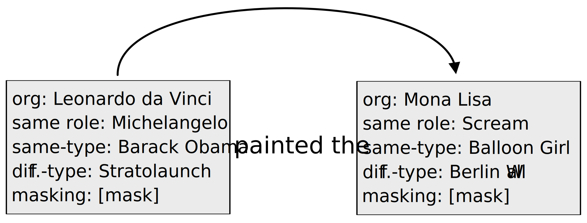

## Pointing out the Shortcomings of Relation Extraction Models with Semantically Motivated Adversarials

**Read the paper**: https://aclanthology.org/2024.lrec-main.1121/

**See the poster we presented**: [poster_adversial_re_lrec-coling.pdf](./poster_adversial_re_lrec-coling.pdf) 





## Dataset

The src/create_adv_dataset.py file is used to generated aversarial dataset. To reproduce you need:

- tacred test file in data/test.json
- a json file of all the entities together with their types named entities_complete.json
  - this file follows the structure:\
    { entity_id :\
    { surface_form : entity surface form,\
    type: type of the entity,\
    subj_of: a list of relations in which this entity appears as subject,\
    obj_of : a list of relations in which this entity appears as an object}\
    ..}\

The script is invoked as follows:
```
python create_adv_dataset.py {N} {M}
```
where {N} identifies the substitution strategy implemented (1: same-role, 2: same-type, 3:diff-type, 4:masked), and {M} identifies the entity to substitute (1: subject, 2: object, 3: both).


**NB**: this code is not optimized, and should only be used for experimental purposes.

## Cite

Please cite [our paper]([https://arxiv.org/abs/1903.02428](https://arxiv.org/abs/2402.19076)) if you use our evaluation dataset in your own work:

```
@inproceedings{nolano-etal-2024-pointing-shortcomings,
    title = "Pointing Out the Shortcomings of Relation Extraction Models with Semantically Motivated Adversarials",
    author = "Nolano, Gennaro  and
      Blum, Moritz  and
      Ell, Basil  and
      Cimiano, Philipp",
    editor = "Calzolari, Nicoletta  and
      Kan, Min-Yen  and
      Hoste, Veronique  and
      Lenci, Alessandro  and
      Sakti, Sakriani  and
      Xue, Nianwen",
    booktitle = "Proceedings of the 2024 Joint International Conference on Computational Linguistics, Language Resources and Evaluation (LREC-COLING 2024)",
    month = may,
    year = "2024",
    address = "Torino, Italia",
    publisher = "ELRA and ICCL",
    url = "https://aclanthology.org/2024.lrec-main.1121",
    pages = "12809--12820",
    abstract = "In recent years, large language models have achieved state-of-the-art performance across various NLP tasks. However, investigations have shown that these models tend to rely on shortcut features, leading to inaccurate predictions and causing the models to be unreliable at generalization to out-of-distribution (OOD) samples. For instance, in the context of relation extraction (RE), we would expect a model to identify the same relation independently of the entities involved in it. For example, consider the sentence {``}Leonardo da Vinci painted the Mona Lisa{''} expressing the created(Leonardo{\_}da{\_}Vinci, Mona{\_}Lisa) relation. If we substiute {``}Leonardo da Vinci{''} with {``}Barack Obama{''}, then the sentence still expresses the created relation. A robust model is supposed to detect the same relation in both cases. In this work, we describe several semantically-motivated strategies to generate adversarial examples by replacing entity mentions and investigate how state-of-the-art RE models perform under pressure. Our analyses show that the performance of these models significantly deteriorates on the modified datasets (avg. of -48.5{\%} in F1), which indicates that these models rely to a great extent on shortcuts, such as surface forms (or patterns therein) of entities, without making full use of the information present in the sentences.",
}

```
